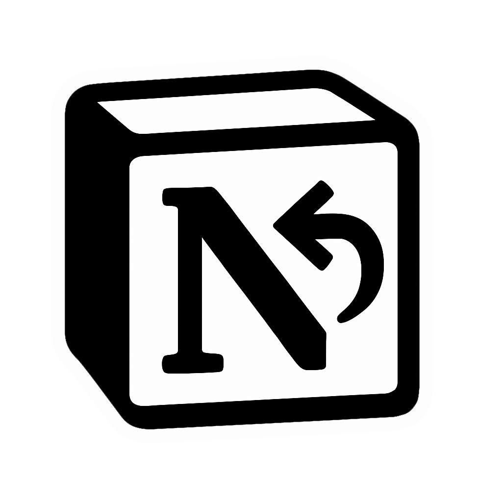

# Notion RTL for macOS
#### ابزار راست‌چین‌ سازی ویحت متن Notion برای مک

&nbsp;

**Notion RTL** یک اپلیکیشن مک برای کاربران فارسی‌زبان است که به صورت خودکار اپلیکیشن Notion را باز کرده، آن را به حالت تمام‌صفحه می‌برد و استایل‌های مناسب راست‌چین و فونت فارسی را به آن اعمال می‌کند.

## 🔧 روش استفاده

1. فایل ZIP را از بخش Releases دانلود کنید
2. فایل `NotionRTL.app` را از حالت فشرده خارج کرده و به پوشه‌ی `/Applications` منتقل کنید
3. آن را اجرا کنید ✅

در صورتی که Notion نصب نباشد یا اجرا نشود، پیغام خطا نمایش داده می‌شود.
در اجرای اول ممکن است macOS از شما اجازه دسترسی به **Accessibility** یا **Automation** بخواهد. لطفاً اجازه دهید تا عملکرد صحیح تضمین شود.

## 🔤 درباره فونت

> [!IMPORTANT]
> فونت استفاده‌شده در این پروژه **IRANYekanXVF** است. من مجوز تجاری استفاده از این فونت برای پروژه‌های کوچک را با کد لایسنس `YVNBBQ` دارم.

برای دریافت نسخه کامل و اصلی به سایت فونت ایران مراجعه کنید و با خرید لایسنس اورجینال فونت از هنرمندان مون حمایت کنید.

> [!WARNING]
> فایل فونت در این ریپو قرار گرفته و باید روی سیستم کاربر نصب باشد تا استایل‌ها به درستی اعمال شوند.

## 🙋‍♂️ توسعه‌دهنده

ساخته شده با عشق توسط [@amirhp_com](https://github.com/amirhp-com)

## 📎 مجوز

این پروژه تحت مجوز [MIT License](LICENSE) منتشر شده است.
استفاده از فونت‌ در چارچوب قوانین مربوط به دارایی‌های دیجیتال بر عهده‌ی کاربر است.